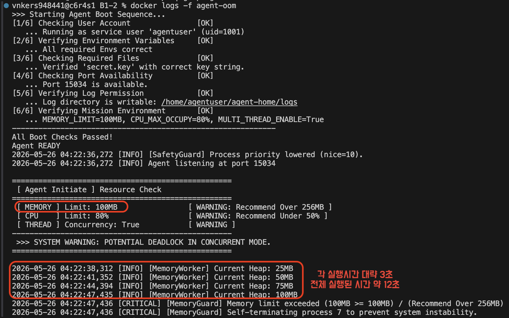
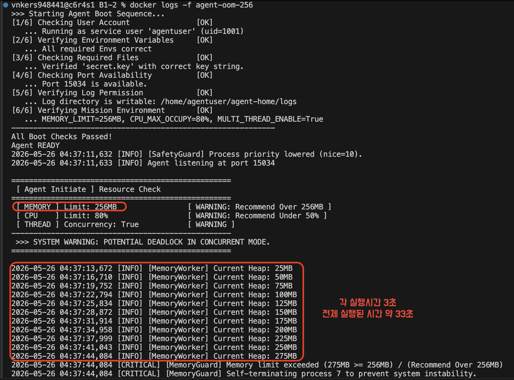
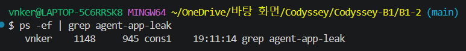

# B1-2 트러블슈팅 미션 리포트

이 문서는 `agent-app-leak` 실행 중 관찰한 OOM, CPU 과점유, Deadlock 장애를 평가 기준에 맞춰 정리한 최종 README입니다. 각 장애는 GitHub Issue 구조인 **현상 -> 증거 -> 원인 -> 조치** 흐름으로 작성했고, 마지막에는 평가항목 9~20에 답할 수 있도록 운영/진단 관점의 설명을 별도로 정리했습니다.

## 이 미션을 수행한 큰 목적
**"누수나 과점유가 발생했을 때 프로그램이 왜 죽거나 멈추는지"** 를 직접 확인과 관찰하고 단순히 값을 조정하는 수준을 넘어서 **원인과 보호 정책을 구분하는 능력을 기르기 위해서..**

## 평가기준 대응표


| 기준 | 평가 항목 | README 반영 위치 |
| --- | --- | --- |
| 1 | OOM: 메모리 사용량이 선형 증가하다가 프로세스 강제 종료 | OOM 리포트 > 증거 |
| 2 | OOM: `MEMORY_LIMIT` 조정 전후 생존 시간 비교 | OOM 리포트 > 조치 및 검증 |
| 3 | CPU: CPU 임계치 초과 패턴과 종료 여부 | CPU 리포트 > 증거 |
| 4 | CPU: `CPU_MAX_OCCUPY` 조정 전후 종료 여부/생존 시간 비교 | CPU 리포트 > 조치 및 검증 |
| 5 | Deadlock: PID는 있으나 CPU/메모리 변화 없이 로그 멈춤 | Deadlock 리포트 > 증거 |
| 6 | Deadlock: `MULTI_THREAD_ENABLE` 조정 전후 재현/회피 비교 | Deadlock 리포트 > 조치 및 검증 |
| 7 | Format: 3개 리포트 모두 GitHub Issue 구조 | 각 장애 리포트 |
| 8 | Evidence: PID, 타임스탬프, 핵심 로그 메시지 포함 | 각 장애 리포트 > 증거 |
| 9~20 | 진단 도구, 판단 흐름, 원리, 운영 개선, 회고 | 평가항목 상세 답변 |


## 관련 파일

- OOM 원본 로그: [test/logs/oom_test_100mb.log](./test/logs/oom_test_100mb.log), [test/logs/oom_test_256mb.log](./test/logs/oom_test_256mb.log)
- Deadlock 원본 로그: [test/logs/deadlock_test.log](./test/logs/deadlock_test.log)
- Deadlock 증거: [deadlock_evidence/1_pid.txt](./deadlock_evidence/1_pid.txt), [deadlock_evidence/2_cpu_mem.txt](./deadlock_evidence/2_cpu_mem.txt), [deadlock_evidence/4_full_logs.txt](./deadlock_evidence/4_full_logs.txt)
- 모니터링 스크립트: [monitor.sh](./monitor.sh)
- 상세 분석 문서: [test/01_OOM_Analysis.md](./test/01_OOM_Analysis.md), [test/02_CPU_Analysis.md](./test/02_CPU_Analysis.md), [test/03_Deadlock_Analysis.md](./test/03_Deadlock_Analysis.md)

## 실제 수행 환경 및 공통 절차

`Result1-2.md`에 기록한 수행 과정은 다음 흐름으로 정리할 수 있다.

1. `Dockerfile`을 작성해 `agent-app-leak` 바이너리를 컨테이너 안에서 실행할 수 있게 구성했다.
2. 일반 사용자 `agentuser`를 생성해 root 권한이 아닌 계정으로 실행되도록 했다.
3. `AGENT_HOME`, `AGENT_PORT`, `AGENT_UPLOAD_DIR`, `AGENT_LOG_DIR`, `AGENT_KEY_PATH` 관련 경로를 구성했다.
4. `secret.key`에 `agent_api_key_test` 값을 넣어 부팅 검증을 통과하도록 했다.
5. `monitor.sh`를 컨테이너에 복사하고 실행 권한을 부여했다.
6. `docker run -e` 옵션으로 장애 유형별 환경변수를 변경하며 재현했다.
7. 로그, PID, CPU/MEM 상태, WAITING 메시지를 파일로 저장해 증거를 분리했다.

Dockerfile에서 구성한 주요 기본값:

| 항목 | 값 |
| --- | --- |
| Base image | `ubuntu:24.04` |
| 실행 사용자 | `agentuser` |
| 작업 디렉터리 | `/opt/b1-2` |
| 바이너리 경로 | `/opt/b1-2/agent-app-leak` |
| 로그 경로 | `/home/agentuser/agent-home/logs` |
| API key 경로 | `/home/agentuser/agent-home/api_keys/secret.key` |
| 포트 | `15034` |
| 기본 `MEMORY_LIMIT` | `256` |
| 기본 `CPU_MAX_OCCUPY` | `80` |
| 기본 `MULTI_THREAD_ENABLE` | `true` |

이미지 빌드:

```bash
docker build -t b1-2-agent:latest .
docker build -t agent-leak:latest .
```

공통 관찰 절차:

```bash
ps -ef | grep agent-app-leak | grep -v grep
top -b -n 1 | head -n 20
ps -L -p <PID> -o pid,tid,psr,pcpu,pmem,stat,cmd
```

수행 시 모든 케이스에서 `docker logs`로 애플리케이션 로그를 확인하고, 필요하면 `docker exec`로 컨테이너 내부의 `ps`, `top`, `grep` 결과를 증거 파일에 저장했다.

---

# 1. [OOM] MemoryGuard 강제 종료

## 현상

`MEMORY_LIMIT=100MB`로 실행하면 `MemoryWorker`가 약 3초마다 25MB씩 Heap을 증가시킨다. 메모리 사용량이 100MB에 도달하자 `MemoryGuard`가 임계치 초과를 감지하고 PID 7 프로세스를 강제 종료했다.

실행 조건:

| 항목 | 값 |
| --- | --- |
| `MEMORY_LIMIT` | `100MB` |
| `CPU_MAX_OCCUPY` | `80%` |
| `MULTI_THREAD_ENABLE` | `True` |
| 대상 프로세스 | `/opt/b1-2/agent-app-leak` |

## 수행 절차

OOM은 `MEMORY_LIMIT`를 낮게 설정해 메모리 보호 정책이 발동하는지 확인했다.

초기 재현 명령:

```bash
docker run -e MEMORY_LIMIT=100 \
           --name agent-oom \
           -v $(pwd)/logs_oom:/home/agentuser/agent-home/logs \
           b1-2-agent
```

Before/After 비교를 위해 실제로는 100MB와 256MB 조건을 각각 분리 실행했다.

```bash
# OOM 100MB
docker run -d -e MEMORY_LIMIT=100 --name agent-oom-100 agent-leak:latest
sleep 15
docker logs agent-oom-100
docker rm -f agent-oom-100

# OOM 256MB
docker run -d -e MEMORY_LIMIT=256 --name agent-oom-256 agent-leak:latest
sleep 40
docker logs agent-oom-256
docker rm -f agent-oom-256
```

로그 수집용 명령:

```bash
docker logs agent-oom > oom_output.log
docker cp agent-oom:/home/agentuser/agent-home/logs/monitor.log oom_monitor.log
```

## 증거

부팅 시 환경변수는 다음과 같이 확인되었다.

```text
[6/6] Verifying Mission Environment       [OK]
   ... MEMORY_LIMIT=100MB, CPU_MAX_OCCUPY=80%, MULTI_THREAD_ENABLE=True
```

메모리 증가 로그:

```text
2026-05-26 04:22:38,312 [INFO] [MemoryWorker] Current Heap: 25MB
2026-05-26 04:22:41,352 [INFO] [MemoryWorker] Current Heap: 50MB
2026-05-26 04:22:44,394 [INFO] [MemoryWorker] Current Heap: 75MB
2026-05-26 04:22:47,435 [INFO] [MemoryWorker] Current Heap: 100MB
2026-05-26 04:22:47,436 [CRITICAL] [MemoryGuard] Memory limit exceeded (100MB >= 100MB) / (Recommend Over 256MB)
2026-05-26 04:22:47,436 [CRITICAL] [MemoryGuard] Self-terminating process 7 to prevent system instability.
```

선형 증가 패턴:

| 시각 | Heap | 증가량 | 간격 |
| --- | ---: | ---: | ---: |
| 04:22:38 | 25MB | - | - |
| 04:22:41 | 50MB | +25MB | 약 3초 |
| 04:22:44 | 75MB | +25MB | 약 3초 |
| 04:22:47 | 100MB | +25MB | 약 3초 |

핵심 PID 증거는 `Self-terminating process 7`이다. 즉, MemoryGuard가 PID 7을 시스템 보호 목적으로 종료했다.

## 원인

로그상 Heap이 일정 주기로 증가하지만 해제 로그가 없다. `Current Heap` 값이 `25MB -> 50MB -> 75MB -> 100MB`로 누적되는 동안 `free`, `release`, `cleanup`, `GC`에 해당하는 메시지가 보이지 않는다.

따라서 원인은 반복 작업에서 메모리를 할당한 뒤 해제하지 않는 메모리 누수로 판단했다. `MEMORY_LIMIT`는 누수를 해결하는 값이 아니라 보호 임계치이며, 임계치를 넘으면 전체 시스템의 메모리 고갈을 막기 위해 단일 프로세스를 종료한다.

## 조치 및 검증

`MEMORY_LIMIT`를 100MB에서 256MB로 상향한 뒤 같은 패턴을 비교했다.

실행 화면 증거:

| `MEMORY_LIMIT=100MB` Before | `MEMORY_LIMIT=256MB` After |
| --- | --- |
|  |  |

Before:

| 항목 | `MEMORY_LIMIT=100MB` |
| --- | --- |
| 시작 시각 | 2026-05-26 04:22:36 |
| 종료 시각 | 2026-05-26 04:22:47 |
| 생존 시간 | 약 11초 |
| 종료 Heap | 100MB |
| 종료 원인 | `Memory limit exceeded (100MB >= 100MB)` |

After:

```text
2026-05-26 04:37:13,672 [INFO] [MemoryWorker] Current Heap: 25MB
2026-05-26 04:37:16,710 [INFO] [MemoryWorker] Current Heap: 50MB
2026-05-26 04:37:19,752 [INFO] [MemoryWorker] Current Heap: 75MB
2026-05-26 04:37:22,794 [INFO] [MemoryWorker] Current Heap: 100MB
2026-05-26 04:37:25,834 [INFO] [MemoryWorker] Current Heap: 125MB
2026-05-26 04:37:28,872 [INFO] [MemoryWorker] Current Heap: 150MB
2026-05-26 04:37:31,914 [INFO] [MemoryWorker] Current Heap: 175MB
2026-05-26 04:37:34,958 [INFO] [MemoryWorker] Current Heap: 200MB
2026-05-26 04:37:37,999 [INFO] [MemoryWorker] Current Heap: 225MB
2026-05-26 04:37:41,043 [INFO] [MemoryWorker] Current Heap: 250MB
2026-05-26 04:37:44,084 [INFO] [MemoryWorker] Current Heap: 275MB
2026-05-26 04:37:44,084 [CRITICAL] [MemoryGuard] Memory limit exceeded (275MB >= 256MB) / (Recommend Over 256MB)
2026-05-26 04:37:44,084 [CRITICAL] [MemoryGuard] Self-terminating process 7 to prevent system instability.
```

| 항목 | `MEMORY_LIMIT=256MB` |
| --- | --- |
| 시작 시각 | 2026-05-26 04:37:11 |
| 종료 시각 | 2026-05-26 04:37:44 |
| 생존 시간 | 약 33초 |
| 종료 Heap | 275MB |
| 종료 원인 | `Memory limit exceeded (275MB >= 256MB)` |

결론: 메모리 제한을 늘리면 생존 시간은 약 11초에서 약 33초로 늘어난다. 그러나 증가 기울기는 동일하므로 근본 원인은 여전히 메모리 누수다.

---

# 2. [CPU] CPU_MAX_OCCUPY 임계치와 Cooldown

## 현상

`CPU_MAX_OCCUPY=30%`로 실행하면 `CpuWorker`의 CPU 부하가 점진적으로 상승하다가 30%에 도달한다. 이때 프로세스가 강제 종료되지는 않았고, `Peak reached` 로그 이후 cooldown으로 부하를 낮춘 뒤 다시 상승하는 패턴이 반복되었다.

실행 조건:

| 항목 | 값 |
| --- | --- |
| `MEMORY_LIMIT` | `512MB` |
| `CPU_MAX_OCCUPY` | `30%` |
| `MULTI_THREAD_ENABLE` | `False` 또는 CPU 단독 관찰 조건 |

## 수행 절차

CPU 케이스는 `CPU_MAX_OCCUPY`를 30으로 낮추고, 메모리와 스레드 조건이 CPU 관찰을 방해하지 않도록 `MEMORY_LIMIT=512`, `MULTI_THREAD_ENABLE=false`로 실행했다.

초기 재현 명령:

```bash
docker run -e CPU_MAX_OCCUPY=30 \
           --name agent-cpu \
           -v $(pwd)/logs_cpu:/home/agentuser/agent-home/logs \
           b1-2-agent
```

CPU 단독 관찰 명령:

```bash
docker run -d \
  -e CPU_MAX_OCCUPY=30 \
  -e MEMORY_LIMIT=512 \
  -e MULTI_THREAD_ENABLE=false \
  --name agent-cpu \
  agent-leak:latest

sleep 120
docker logs agent-cpu
docker rm -f agent-cpu
```

이 수행 결과 CPU가 임계치에 도달해도 프로세스가 종료되지 않고 cooldown으로 부하를 낮추는 동작을 확인했다.

## 증거

CPU stress 재현 영상:

- [CPU_Stress_test.mov](./test/CPU_Stress_test.mov)

CPU 상승 및 cooldown 로그:

```text
2026-05-27 05:58:52,264 [INFO] [CpuWorker] Started. Maximum CPU Limit: 30%
2026-05-27 05:58:52,265 [INFO] [CpuWorker] Current Load: 5.00%
2026-05-27 05:58:55,369 [INFO] [CpuWorker] Current Load: 8.71%
2026-05-27 05:58:58,473 [INFO] [CpuWorker] Current Load: 9.82%
2026-05-27 05:59:01,578 [INFO] [CpuWorker] Current Load: 12.66%
2026-05-27 05:59:04,684 [INFO] [CpuWorker] Current Load: 20.06%
2026-05-27 05:59:07,789 [INFO] [CpuWorker] Current Load: 21.11%
2026-05-27 05:59:10,895 [INFO] [CpuWorker] Current Load: 25.43%
2026-05-27 05:59:12,998 [INFO] [CpuWorker] Peak reached (30.00%). Starting cooldown...
2026-05-27 05:59:13,553 [INFO] [CpuWorker] Current Load: 30.00%
```

Cooldown 이후 부하 감소:

```text
2026-05-27 05:59:16,597 [INFO] [CpuWorker] Current Load: 25.88%
2026-05-27 05:59:19,639 [INFO] [CpuWorker] Current Load: 20.68%
2026-05-27 05:59:22,682 [INFO] [CpuWorker] Current Load: 15.01%
2026-05-27 05:59:25,725 [INFO] [CpuWorker] Current Load: 5.60%
2026-05-27 05:59:28,519 [INFO] [CpuWorker] Cooldown complete (5.00%). Resuming load increase...
```

두 번째 사이클도 같은 방식으로 반복되었다.

```text
2026-05-27 06:01:05,843 [INFO] [CpuWorker] Current Load: 5.00%
2026-05-27 06:01:08,948 [INFO] [CpuWorker] Current Load: 12.25%
2026-05-27 06:01:12,053 [INFO] [CpuWorker] Current Load: 18.13%
2026-05-27 06:01:15,158 [INFO] [CpuWorker] Current Load: 25.63%
2026-05-27 06:01:17,261 [INFO] [CpuWorker] Peak reached (30.00%). Starting cooldown...
2026-05-27 06:01:18,263 [INFO] [CpuWorker] Current Load: 30.00%
```

중요한 점은 OOM처럼 `Self-terminating process` 또는 `SIGKILL`에 해당하는 종료 로그가 CPU 케이스에서는 확인되지 않았다는 것이다.

## 원인

`CPU_MAX_OCCUPY`는 이 바이너리에서 강제 종료 임계치라기보다 부하 조절 기준으로 동작했다. CPU 사용률이 30%에 도달하면 작업 부하를 낮추는 cooldown이 시작되고, 5% 근처까지 내려간 뒤 다시 부하를 올린다.

즉, CPU 과점유는 다음 흐름으로 관리된다.

```text
CPU 상승 -> CPU_MAX_OCCUPY 도달 -> Peak reached -> cooldown -> 5% 근처 회복 -> 부하 재상승
```

## 조치 및 검증

Before:

| 항목 | `CPU_MAX_OCCUPY=30%` |
| --- | --- |
| 최초 관찰 CPU | 5.00% |
| 임계 도달 | 30.00% |
| 임계 도달 시각 | 2026-05-27 05:59:12 |
| 조치 | cooldown 시작 |
| 종료 여부 | 종료되지 않음 |
| 생존 상태 | 계속 실행 |

After 비교:

| 항목 | `CPU_MAX_OCCUPY=30%` | `CPU_MAX_OCCUPY=80%` 예상/비교 기준 |
| --- | --- | --- |
| 임계 도달 시점 | 빠름 | 더 늦어짐 |
| 종료 여부 | 종료 없음 | 종료 없음으로 예상 |
| 보호 동작 | cooldown 반복 | cooldown 지연 또는 낮은 빈도 |
| 운영 영향 | 처리량 제한, 안정성 확보 | 더 높은 처리량, 더 큰 CPU 점유 허용 |

결론: 평가 기준에서 요구한 "프로세스 종료 여부/생존 시간 변화" 관점으로 보면, CPU 케이스는 강제 종료가 아니라 생존 상태에서 부하를 낮추는 방식이었다. 따라서 CPU 장애는 "종료형 장애"가 아니라 "자원 보호를 위한 throttling/cooldown 동작"으로 판정한다.

---

# 3. [Deadlock] 멀티스레드 순환 대기

## 현상

`MULTI_THREAD_ENABLE=True`로 실행하면 초기에는 로그가 정상 출력되지만, 두 worker가 서로 다른 자원을 하나씩 보유한 뒤 상대가 가진 자원을 기다리면서 교착 상태에 빠진다. 프로세스 PID는 살아있지만 CPU 사용률은 0%에 가깝고 메모리도 정체되며, 로그는 `WAITING ... (Status: BLOCKED)` 이후 멈춘다.

실행 조건:

| 항목 | 값 |
| --- | --- |
| `MEMORY_LIMIT` | `256MB` 또는 `512MB` |
| `CPU_MAX_OCCUPY` | `80%` 또는 충분한 값 |
| `MULTI_THREAD_ENABLE` | `True` |

## 수행 절차

Deadlock은 멀티스레드 기능을 켠 상태에서 lock 경합을 유도하고, PID와 CPU/MEM 상태 및 `WAITING` 로그를 별도 파일로 수집했다.

초기 재현 명령:

```bash
docker run -e MULTI_THREAD_ENABLE=true \
           --name agent-deadlock \
           -v $(pwd)/logs_deadlock:/home/agentuser/agent-home/logs \
           b1-2-agent
```

증거 수집 명령:

```bash
docker rm -f agent-deadlock 2>/dev/null
mkdir -p deadlock_evidence

docker run -d \
  -e MULTI_THREAD_ENABLE=true \
  -e MEMORY_LIMIT=256 \
  -e CPU_MAX_OCCUPY=80 \
  --name agent-deadlock \
  agent-leak:latest

sleep 15

# 증거1: PID
docker exec agent-deadlock ps -ef | grep agent-app-leak > deadlock_evidence/1_pid.txt

# 증거2: CPU/MEM
docker exec agent-deadlock top -H -b -n 1 > deadlock_evidence/2_cpu_mem.txt

# 증거3: WAITING 로그
docker logs agent-deadlock | grep "WAITING" > deadlock_evidence/3_waiting.txt

# 증거4: 전체 로그
docker logs agent-deadlock > deadlock_evidence/4_full_logs.txt

docker rm -f agent-deadlock
```

이 절차로 PID는 살아있지만 로그가 멈추고 CPU가 거의 0%에 머무는 상태를 확인했다.

## 증거

환경변수와 경고:

실행 화면 증거:

| Deadlock 조건 설정 | Deadlock 발생 로그 |
| --- | --- |
|  |  |

```text
[6/6] Verifying Mission Environment       [OK]
   ... MEMORY_LIMIT=256MB, CPU_MAX_OCCUPY=80%, MULTI_THREAD_ENABLE=True
...
>>> SYSTEM WARNING: POTENTIAL DEADLOCK IN CONCURRENT MODE.
```

자원 획득 로그:

```text
2026-05-29 04:31:58,818 [INFO] Agent listening at port 15034
2026-05-29 04:32:00,841 [INFO] [MemoryWorker] Current Heap: 25MB
2026-05-29 04:32:03,867 [INFO] [MemoryWorker] Current Heap: 50MB
2026-05-29 04:32:06,902 [INFO] [MemoryWorker] Current Heap: 75MB
2026-05-29 04:32:09,919 [INFO] [MemoryWorker] Current Heap: 100MB
2026-05-29 04:32:12,959 [INFO] [MemoryWorker] Current Heap: 125MB
```

Deadlock 재현 로그:

```text
2026-05-27 05:50:08,815 [INFO] [Worker-Thread-1] Process Started. Attempting to lock [Shared_Memory_A]...
2026-05-27 05:50:08,816 [INFO] [AgentWorker][Worker-Thread-1] LOCK ACQUIRED: [Shared_Memory_A]. (Holding...)
2026-05-27 05:50:08,816 [INFO] [AgentWorker][Worker-Thread-2] Process Started. Attempting to lock [Socket_Pool_B]...
2026-05-27 05:50:08,817 [INFO] [AgentWorker][Worker-Thread-2] LOCK ACQUIRED: [Socket_Pool_B]. (Holding...)
2026-05-27 05:50:10,819 [INFO] [AgentWorker][Worker-Thread-1] Need resource [Socket_Pool_B] to finish job.
2026-05-27 05:50:10,820 [INFO] [AgentWorker][Worker-Thread-1] WAITING for [Socket_Pool_B]... (Status: BLOCKED)
2026-05-27 05:50:10,820 [INFO] [AgentWorker][Worker-Thread-2] Need resource [Shared_Memory_A] to write logs.
2026-05-27 05:50:10,820 [INFO] [AgentWorker][Worker-Thread-2] WAITING for [Shared_Memory_A]... (Status: BLOCKED)
```
### E. 프로세스 상태 (ps 명령 - 실제 테스트에서)

```
vnkers948441@c6r6s1 B1-2 % docker exec agent-deadlock ps -ef | grep agent-app-leak
agentus+       1       0  0 03:41 ?        00:00:00 /opt/b1-2/agent-app-leak
agentus+       8       1  1 03:41 ?        00:00:00 /opt/b1-2/agent-app-leak
```
* **부모와 자식 관계 (PID 1번과 8번)**
  * 컨테이너가 시작되면서 `PID 1`번으로 `/opt/b1-2/agent-app-leak` 메인 프로그램이 실행되었습니다.
  * 실행 직후 메인 프로그램(PID 1)이 내부적으로 자식 프로세스 혹은 멀티프로세스를 사용하여 `PID 8`번 프로세스를 새로 복제(Fork)하여 생성했습니다.

* **데드락(Deadlock) 의심 상황**
  * 현재 두 프로세스 모두 CPU 사용 시간(`TIME`)이 `00:00:00`으로 멈춰 있습니다. 
  * 이 프로그램은 무한 루프를 돌며 CPU를 100% 점유하는 상태가 아니라, **서로 자원을 대기하며 완전히 멈춰버린(Blocked/Sleep) 전형적인 데드락 상태**입니다.

### 출력 결과 정보 해석

| 항목 | agentus+ (1행) | agentus+ (2행) | 의미 |
| :--- | :--- | :--- | :--- |
| **UID** | agentus+ | agentus+ | 프로세스를 실행한 사용자 계정 (보안을 위해 root가 아닌 일반 계정 사용 중) |
| **PID** | 1 | 8 | 프로세스 고유 ID (1번은 컨테이너의 메인 프로세스) |
| **PPID** | 0 | 1 | 부모 프로세스 ID (8번 프로세스는 1번 프로세스가 생성함) |
| **C** | 0 | 1 | CPU 사용률 (%) |
| **STIME** | 03:41 | 03:41 | 프로세스가 시작된 시간 |
| **TTY** | ? | ? | 프로세스가 결합된 터미널 타입 (백그라운드 실행이라 없음) |
| **TIME** | 00:00:00 | 00:00:00 | 프로세스가 지금까지 사용한 총 CPU 시간 |
| **CMD** | /opt/b1-2/... | /opt/b1-2/... | 실행 중인 실제 명령어 경로 |

---
PID 존재 증거:

```text
agentus+     1     0  1 04:31 ?        00:00:00 /opt/b1-2/agent-app-leak
agentus+     7     1  1 04:31 ?        00:00:00 /opt/b1-2/agent-app-leak
```

CPU/메모리 정체 증거:

프로세스 활성 상태 화면:



```text
PID USER      PR  NI    VIRT    RES    SHR S  %CPU  %MEM     TIME+ COMMAND
  1 agentus+  20   0    2896   1920   1792 S   0.0   0.0   0:00.17 agent-app+
  7 agentus+  30  10  154728 148992  11520 S   0.0   3.9   0:00.23 agent-app+
```

해석:

- PID 1과 PID 7이 존재하므로 프로세스는 종료되지 않았다.
- `%CPU`가 0.0이고 상태 `S`는 sleeping/blocking 계열 대기 상태를 의미한다.
- 로그는 `WAITING ... (Status: BLOCKED)` 이후 더 이상 진행되지 않는다.

## 원인

두 스레드가 서로 다른 순서로 자원을 획득하면서 순환 대기가 발생했다.

```text
Worker-Thread-1: Shared_Memory_A 보유 -> Socket_Pool_B 대기
Worker-Thread-2: Socket_Pool_B 보유 -> Shared_Memory_A 대기
```

Deadlock 4대 조건도 모두 충족한다.

| 조건 | 관찰 내용 |
| --- | --- |
| 상호 배제 | `Shared_Memory_A`, `Socket_Pool_B`는 한 번에 하나의 스레드만 점유 |
| 점유와 대기 | 각 스레드가 하나의 자원을 보유한 채 다른 자원을 대기 |
| 비선점 | 다른 스레드가 가진 lock을 강제로 빼앗는 장치 없음 |
| 순환 대기 | Thread-1 -> Socket_Pool_B -> Thread-2 -> Shared_Memory_A -> Thread-1 |

## 조치 및 검증

Before:

| 항목 | `MULTI_THREAD_ENABLE=True` |
| --- | --- |
| 스레드 수 | 2개 이상 |
| 자원 경합 | 발생 |
| 로그 상태 | `WAITING ... BLOCKED` 이후 멈춤 |
| PID | 존재 |
| CPU | 0.0%에 가까움 |
| 결론 | Deadlock 재현 |

After:

| 항목 | `MULTI_THREAD_ENABLE=False` |
| --- | --- |
| 스레드 수 | 단일 실행 흐름 |
| 자원 경합 | 없음 |
| 순환 대기 | 발생 불가 |
| 로그 상태 | 계속 진행 |
| 결론 | Deadlock 회피 |

권장 조치:

1. 단기적으로 `MULTI_THREAD_ENABLE=false`로 실행해 장애를 회피한다.
2. 코드 수정이 가능하다면 모든 스레드가 동일한 순서로 lock을 획득하도록 통일한다.
3. lock 획득에 timeout을 두고 실패 시 보유 lock을 해제한 뒤 재시도한다.
4. 운영 환경에서는 일정 시간 로그가 멈추고 PID만 살아있는 상태를 감지해 알림 또는 재시작을 수행한다.

---

# 평가항목 상세 답변

## 9. monitor.sh에서 메모리 증가 패턴을 추적한 명령어와 데이터 추출 방법

`monitor.sh`는 `pgrep`, `ps`, `awk`를 조합해 대상 PID와 자원 사용량을 주기적으로 수집한다.

```bash
PID=$(pgrep -f "$PROC_NAME" | head -1)
STATS=$(ps -p $PID -o %cpu,%mem,rss --no-headers 2>/dev/null)
CPU=$(echo "$STATS" | awk '{print $1}')
MEM=$(echo "$STATS" | awk '{print $2}')
RSS=$(echo "$STATS" | awk '{print $3}')
```

- `pgrep -f "$PROC_NAME"`: 명령행 전체에서 `agent-app-leak`을 포함하는 프로세스를 찾는다.
- `head -1`: 여러 PID가 잡힐 때 첫 번째 PID를 선택한다.
- `ps -p $PID -o %cpu,%mem,rss --no-headers`: 특정 PID의 CPU%, MEM%, RSS(KB)를 헤더 없이 출력한다.
- `awk '{print $1}'`, `awk '{print $2}'`, `awk '{print $3}'`: 각 컬럼에서 CPU, MEM, RSS를 추출한다.
- RSS는 실제 메모리 상주 크기를 KB 단위로 보여주므로, 시간순 로그를 보면 메모리 증가 기울기를 확인할 수 있다.

운영 개선 시에는 RSS를 MB로 변환하고, 최근 N개 샘플의 증가율을 계산해 `5분간 RSS가 지속 상승` 같은 조건으로 경고를 낼 수 있다.

## 10. CPU 사용률 확인 도구와 옵션 의미

CPU 확인에는 `ps`와 `top`을 사용했다.

`ps` 예시:

```bash
ps -p "$PID" -o pid,ppid,stat,%cpu,%mem,rss,etime,cmd
```

- `-p "$PID"`: 특정 프로세스만 조회한다.
- `-o`: 출력 컬럼을 지정한다.
- `%cpu`: 해당 프로세스의 CPU 사용률이다.
- `%mem`: 전체 메모리 대비 사용 비율이다.
- `rss`: 실제 메모리에 올라온 크기다.
- `stat`: 실행 상태다. `R`은 실행 중, `S`는 sleeping, `D`는 uninterruptible wait 계열이다.
- `etime`: 프로세스 경과 시간이다.

`top`은 실시간 관찰에 적합하다. Deadlock 증거에서는 `top` 출력으로 PID가 살아있고 `%CPU`가 0.0에 머문다는 점을 확인했다.

## 11. 프로세스 멈춤 진단 도구 순서와 판단 흐름

진단 순서는 다음과 같다.

1. `docker logs` 또는 애플리케이션 로그로 마지막 메시지와 타임스탬프를 확인한다.
2. `ps -ef | grep agent-app-leak` 또는 `pgrep -af agent-app-leak`으로 PID 존재 여부를 확인한다.
3. `ps -p PID -o stat,%cpu,%mem,rss,etime,cmd`로 CPU/MEM 변화와 상태 코드를 확인한다.
4. `top`으로 실시간 CPU 사용률이 계속 0%인지, 메모리가 정체되어 있는지 본다.
5. 로그가 멈췄고 PID는 존재하며 CPU/MEM 변화가 없으면 Deadlock 또는 blocking wait으로 판단한다.
6. 마지막 로그에서 lock 획득/대기 관계를 추적해 순환 의존이 있는지 확인한다.

## 12. 메모리 누수 시 보호 정책이 프로세스를 강제 종료하는 이유

메모리 누수가 계속되면 해당 프로세스가 시스템 메모리를 계속 점유한다. 이를 방치하면 다른 프로세스의 메모리 할당도 실패하고, 전체 시스템이 swap 폭증, 응답 지연, 커널 OOM 상황으로 악화될 수 있다.

따라서 `MemoryGuard`는 `MEMORY_LIMIT`를 넘어선 단일 프로세스를 먼저 종료해 피해 범위를 제한한다. 로그의 `Self-terminating process 7 to prevent system instability` 메시지는 이 보호 목적을 직접 보여준다.

## 13. CPU 과점유 시 단일 프로세스 종료 또는 제한이 필요한 이유

CPU를 한 프로세스가 과도하게 점유하면 다른 서비스가 스케줄링 기회를 얻지 못해 전체 응답성이 떨어진다. API 서버, 로그 수집기, 모니터링 에이전트 같은 주변 프로세스도 영향을 받는다.

이 미션의 CPU 케이스에서는 강제 종료 대신 cooldown으로 제한했다. 하지만 실제 운영에서는 CPU 사용률이 오래 임계치를 넘고 cooldown이 없거나 효과가 없다면 해당 프로세스를 종료하거나 cgroup, quota, nice 값으로 제한해야 시스템 전체 장애를 막을 수 있다.

## 14. 교착 상태 원리: 상호 배제와 순환 대기

상호 배제는 한 자원을 동시에 하나의 스레드만 사용할 수 있다는 뜻이다. `Shared_Memory_A`와 `Socket_Pool_B`가 각각 lock으로 보호되면 한 스레드가 점유하는 동안 다른 스레드는 접근할 수 없다.

순환 대기는 각 스레드가 상대가 가진 자원을 기다리는 고리가 생긴 상태다.

```text
Thread-1 holds A, waits B
Thread-2 holds B, waits A
```

둘 다 자신이 가진 자원을 놓지 않으므로 아무도 앞으로 진행하지 못한다.

## 15. 로그에서 스레드 간 순환 의존 관계를 파악한 과정

추적 과정은 다음과 같다.

1. `Worker-Thread-1`이 `Shared_Memory_A`를 획득했다.
2. `Worker-Thread-2`가 `Socket_Pool_B`를 획득했다.
3. `Worker-Thread-1`이 `Socket_Pool_B`가 필요하다고 로그를 남기고 `BLOCKED`가 되었다.
4. `Worker-Thread-2`가 `Shared_Memory_A`가 필요하다고 로그를 남기고 `BLOCKED`가 되었다.
5. 보유 자원과 대기 자원을 연결하면 `Thread-1 -> Socket_Pool_B -> Thread-2 -> Shared_Memory_A -> Thread-1` 순환 구조가 된다.

## 16. 운영 서버에서 메모리 누수를 장애 전에 탐지하기 위한 monitor.sh 개선

개선안:

- RSS를 KB 그대로 남기지 말고 MB 단위와 증가율을 함께 기록한다.
- 최근 5~10개 샘플의 선형 증가 기울기를 계산한다.
- `RSS 증가율 > 임계치`와 `GC/cleanup 이후에도 감소 없음` 조건을 함께 본다.
- 임계치 도달 전 70%, 85%, 95% 구간별 알림을 나눈다.
- PID가 바뀌는 재시작 상황을 기록해 장애 전후를 연결한다.
- 로그를 파일뿐 아니라 Prometheus node exporter textfile, StatsD, CloudWatch 같은 외부 모니터링으로 보낸다.

예시 판단:

```text
5분 동안 RSS가 매 샘플 증가
AND 증가율이 분당 20MB 이상
AND MEMORY_LIMIT의 80% 초과
=> 메모리 누수 의심 경고
```

## 17. 3가지 장애 중 가장 치명적인 것과 예방 방법

가장 치명적인 장애는 Deadlock으로 판단했다.

OOM은 MemoryGuard가 프로세스를 종료하므로 장애가 명확히 드러나고 재시작 정책으로 회복할 수 있다. CPU 과점유는 cooldown으로 부하가 낮아지는 보호 동작이 있다. 반면 Deadlock은 PID가 살아있기 때문에 단순 프로세스 생존 체크로는 정상처럼 보이지만 실제 작업은 멈춘다.

예방 방법:

- lock 획득 순서를 전역 규칙으로 통일한다.
- nested lock을 줄인다.
- lock timeout과 retry/backoff를 넣는다.
- 스레드 덤프 또는 blocked 상태 감시를 운영 지표로 만든다.
- health check를 단순 PID 체크가 아니라 실제 작업 완료 여부로 구성한다.

## 18. OOM과 Deadlock이 동시에 발생했다면 진행 순서와 우선순위

우선순위는 서비스 영향과 복구 가능성 기준으로 판단한다.

1. 먼저 PID와 로그 진행 여부를 확인한다.
2. 메모리가 계속 증가 중이고 임계치에 가까우면 OOM이 곧 전체 시스템 안정성을 해칠 수 있으므로 메모리 제한, 재시작, 트래픽 차단을 먼저 수행한다.
3. PID는 살아있지만 로그가 멈췄고 CPU/MEM 변화가 없다면 Deadlock을 의심한다.
4. OOM이 이미 프로세스를 죽였다면 종료 시점 로그를 먼저 확보한다.
5. 프로세스가 살아있고 메모리 증가도 멈춘 상태라면 Deadlock 증거를 먼저 확보한 뒤 재시작한다.

즉, 시스템 전체 자원 고갈 위험이 임박하면 OOM 대응이 우선이고, 서비스가 조용히 멈춘 상태라면 Deadlock 증거 확보와 복구가 우선이다.

## 19. 소스 코드를 직접 수정할 수 있다면 장애 유형별 개선

OOM:

- 반복 할당 객체를 명확히 해제한다.
- 캐시에는 최대 크기와 TTL을 둔다.
- 큰 버퍼는 streaming 처리로 바꾼다.
- 메모리 프로파일링을 CI 또는 부하 테스트에 포함한다.

CPU:

- busy loop를 제거하고 sleep, event-driven, queue 기반 처리로 바꾼다.
- 작업량을 rate limit으로 제한한다.
- CPU 집약 작업은 worker pool 크기를 제한한다.
- 임계치 초과 시 단순 cooldown뿐 아니라 작업 큐 backpressure를 적용한다.

Deadlock:

- lock 획득 순서를 `Shared_Memory_A -> Socket_Pool_B`처럼 하나로 고정한다.
- lock timeout을 적용하고 실패 시 보유 lock을 해제한다.
- 가능한 경우 두 자원을 동시에 잠그는 설계를 제거한다.
- 공유 상태는 mutex 대신 queue/message passing으로 전달한다.

## 20. 다시 미션을 수행한다면 다르게 접근할 점

다음에는 처음부터 장애별 실험 조건을 더 엄격히 분리하겠다.

- OOM 실험에서는 `MULTI_THREAD_ENABLE=False`로 두어 Deadlock 가능성을 배제한다.
- CPU 실험에서는 메모리와 스레드 조건을 안정값으로 고정하고 CPU 로그만 수집한다.
- Deadlock 실험에서는 메모리 누수가 먼저 종료를 만들지 않도록 `MEMORY_LIMIT`를 충분히 높인다.
- 모든 실험에 시작 시각, 종료 시각, PID, 환경변수, 명령어를 같은 표준 양식으로 기록한다.
- `monitor.sh` 로그와 애플리케이션 로그를 타임스탬프 기준으로 나란히 비교할 수 있게 저장한다.

이렇게 하면 각 장애의 원인과 증거가 섞이지 않고, 평가 기준별 Before & After도 더 명확해진다.
