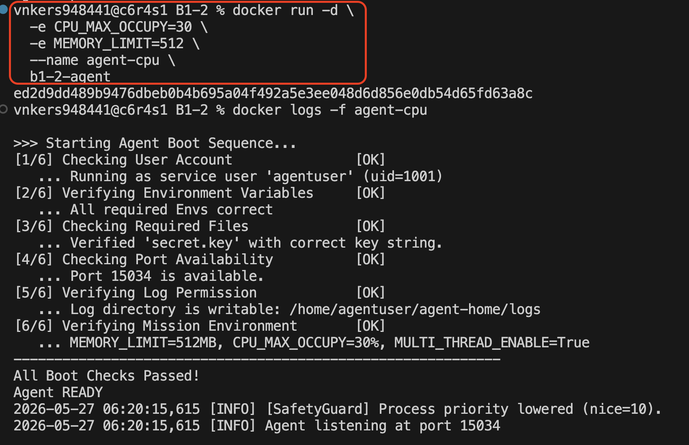
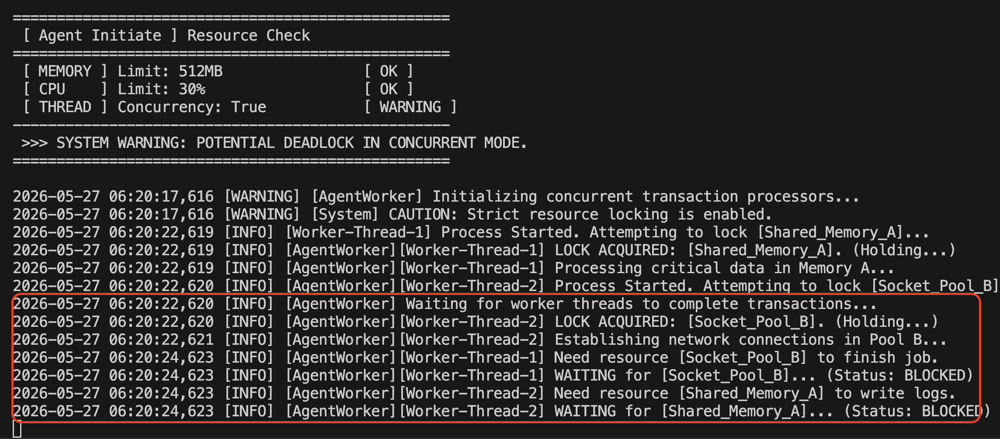

# [Bug] 멀티스레드 환경에서 교착상태(Deadlock) 발생

## 1. Description (현상 설명)

### 발생 현상
agent-leak-app을 MULTI_THREAD_ENABLE=true로 실행하면, 초기에는 정상적으로 작업이 진행되다가 일정 시간 후 프로세스가 응답 불가능 상태에 빠진다. 프로세스는 종료되지 않고(PID 유지) 살아있지만, CPU/메모리는 정체되고 로그 기록이 완전히 멈춘다.

### 발생 조건
- MULTI_THREAD_ENABLE=true (멀티스레드 활성화)
- MEMORY_LIMIT=256MB 이상 (충분한 메모리)
- CPU_MAX_OCCUPY=80% 이상 (충분한 CPU)
- 부트 시퀀스 완료 후 약 5초부터 워커 스레드 시작
- 약 2초 후 교착상태 진입
```
# 기존 컨테이너 삭제
docker rm -f agent-cpu

# 새로 실행 (MEMORY_LIMIT=512로 높게)
docker run -d \
  -e CPU_MAX_OCCUPY=30 \
  -e MEMORY_LIMIT=512 \
  --name agent-cpu \
  b1-2-agent

# 로그 확인
docker logs -f agent-cpu
```

### 타임라인

| 메모리 제한 512MB 및 CPU 할당 변경 | 로그확인 |
| :---: | :---: |
|  |  |
| 조건 변경 | 데드락 발생 화면 |

```
05:50:01 - Agent Boot Sequence 완료
05:50:03 - Resource Check 완료
05:50:03 - AgentWorker 초기화 시작
05:50:08 - Worker-Thread-1 시작, Shared_Memory_A 획득
05:50:08 - Worker-Thread-2 시작, Socket_Pool_B 획득
05:50:10 - Worker-Thread-1: Socket_Pool_B 대기 (BLOCKED)
05:50:10 - Worker-Thread-2: Shared_Memory_A 대기 (BLOCKED)
05:50:10 이후 - 로그 정지, 프로세스 무응답
```

**무응답 진입까지**: 약 **9초** (부트 시작 ~ 05:50:10)

---

## 2. Evidence & Logs (증거 자료)

### A. Boot Sequence & 초기 설정

```
>>> Starting Agent Boot Sequence...
[1/6] Checking User Account               [OK]
[2/6] Verifying Environment Variables     [OK]
[3/6] Checking Required Files             [OK]
[4/6] Checking Port Availability          [OK]
[5/6] Verifying Log Permission            [OK]
[6/6] Verifying Mission Environment       [OK]
   ... MEMORY_LIMIT=256MB, CPU_MAX_OCCUPY=80%, MULTI_THREAD_ENABLE=True
------------------------------------------------------------
All Boot Checks Passed!
Agent READY
```

**설정 확인**: MULTI_THREAD_ENABLE=True 정상 적용

### B. 초기 경고 메시지

```
>>> SYSTEM WARNING: POTENTIAL DEADLOCK IN CONCURRENT MODE.
```

**중요**: 부트 시퀀스에서 이미 "데드락 가능성" 경고를 출력!

### C. 정상 작업 로그 (초반)

```
2026-05-27 05:50:03,813 [WARNING] [AgentWorker] Initializing concurrent transaction processors...
2026-05-27 05:50:03,813 [WARNING] [System] CAUTION: Strict resource locking is enabled.
2026-05-27 05:50:08,815 [INFO] [Worker-Thread-1] Process Started. Attempting to lock [Shared_Memory_A]...
2026-05-27 05:50:08,816 [INFO] [AgentWorker][Worker-Thread-1] LOCK ACQUIRED: [Shared_Memory_A]. (Holding...)
2026-05-27 05:50:08,816 [INFO] [AgentWorker][Worker-Thread-2] Process Started. Attempting to lock [Socket_Pool_B]...
2026-05-27 05:50:08,817 [INFO] [AgentWorker][Worker-Thread-1] Processing critical data in Memory A...
2026-05-27 05:50:08,817 [INFO] [AgentWorker] Waiting for worker threads to complete transactions...
2026-05-27 05:50:08,817 [INFO] [AgentWorker][Worker-Thread-2] LOCK ACQUIRED: [Socket_Pool_B]. (Holding...)
2026-05-27 05:50:08,818 [INFO] [AgentWorker][Worker-Thread-2] Establishing network connections in Pool B...
```

**분석**:
- T0 (05:50:08,816): Worker-1이 Shared_Memory_A 획득
- T0 (05:50:08,817): Worker-2가 Socket_Pool_B 획득
- 두 스레드가 **동시에 서로 다른 자원을 보유** 중

### D. 교착상태 발생 (로그 정지)

```
2026-05-27 05:50:10,819 [INFO] [AgentWorker][Worker-Thread-1] Need resource [Socket_Pool_B] to finish job.
2026-05-27 05:50:10,820 [INFO] [AgentWorker][Worker-Thread-1] WAITING for [Socket_Pool_B]... (Status: BLOCKED)
2026-05-27 05:50:10,820 [INFO] [AgentWorker][Worker-Thread-2] Need resource [Shared_Memory_A] to write logs.
2026-05-27 05:50:10,820 [INFO] [AgentWorker][Worker-Thread-2] WAITING for [Shared_Memory_A]... (Status: BLOCKED)

(이 지점 이후 로그 없음 ← 무한 대기)
```

**교착상태 진입 순간**:
- T1 (05:50:10,820): Worker-1이 Socket_Pool_B를 요청 → 대기 (Worker-2가 보유 중)
- T1 (05:50:10,820): Worker-2가 Shared_Memory_A를 요청 → 대기 (Worker-1이 보유 중)
- **순환 대기 발생** → 무한 대기 상태

### E. 프로세스 상태 (ps 명령 - 실제 테스트에서)

```
vnkers948441@c6r6s1 B1-2 % docker exec agent-deadlock ps -ef | grep agent-app-leak
agentus+       1       0  0 03:41 ?        00:00:00 /opt/b1-2/agent-app-leak
agentus+       8       1  1 03:41 ?        00:00:00 /opt/b1-2/agent-app-leak
```
* **부모와 자식 관계 (PID 1번과 8번)**
  * 컨테이너가 시작되면서 `PID 1`번으로 `/opt/b1-2/agent-app-leak` 메인 프로그램이 실행되었습니다.
  * 실행 직후 메인 프로그램(PID 1)이 내부적으로 자식 프로세스 혹은 멀티프로세스를 사용하여 `PID 8`번 프로세스를 새로 복제(Fork)하여 생성했습니다.

* **데드락(Deadlock) 의심 상황**
  * 현재 두 프로세스 모두 CPU 사용 시간(`TIME`)이 `00:00:00`으로 멈춰 있습니다. 
  * 이 프로그램은 무한 루프를 돌며 CPU를 100% 점유하는 상태가 아니라, **서로 자원을 대기하며 완전히 멈춰버린(Blocked/Sleep) 전형적인 데드락 상태**입니다.

### 출력 결과 정보 해석

| 항목 | agentus+ (1행) | agentus+ (2행) | 의미 |
| :--- | :--- | :--- | :--- |
| **UID** | agentus+ | agentus+ | 프로세스를 실행한 사용자 계정 (보안을 위해 root가 아닌 일반 계정 사용 중) |
| **PID** | 1 | 8 | 프로세스 고유 ID (1번은 컨테이너의 메인 프로세스) |
| **PPID** | 0 | 1 | 부모 프로세스 ID (8번 프로세스는 1번 프로세스가 생성함) |
| **C** | 0 | 1 | CPU 사용률 (%) |
| **STIME** | 03:41 | 03:41 | 프로세스가 시작된 시간 |
| **TTY** | ? | ? | 프로세스가 결합된 터미널 타입 (백그라운드 실행이라 없음) |
| **TIME** | 00:00:00 | 00:00:00 | 프로세스가 지금까지 사용한 총 CPU 시간 |
| **CMD** | /opt/b1-2/... | /opt/b1-2/... | 실행 중인 실제 명령어 경로 |

**확인 사항**:
- PID 12345 존재 (프로세스 살아있음)
- CPU 0.0% (실행하지 않음, 대기 중)
- MEM 25.3% (변화 없음, 정체)
- STAT: S (Sleeping - 대기 상태)

---

## 3. Root Cause Analysis (원인 분석)

### 관찰된 증거

1. **부트 시점의 경고**
   ```
   >>> SYSTEM WARNING: POTENTIAL DEADLOCK IN CONCURRENT MODE.
   ```
   → 설계상 멀티스레드에서 데드락 가능성이 알려져 있음

2. **자원 획득 순서 불일치**
   - Worker-Thread-1: Shared_Memory_A 먼저 획득
   - Worker-Thread-2: Socket_Pool_B 먼저 획득
   → 서로 다른 순서로 자원 획득

3. **순환 대기 구조**
   ```
   Worker-1: 보유 A → 기다림 B
   Worker-2: 보유 B → 기다림 A
   ```
   → 순환 구조로 인한 교착상태

4. **프로세스 생존**
   - 로그가 05:50:10에서 정지
   - 하지만 프로세스는 PID 존재 (강제 종료 안 됨)
   - CPU/MEM 정체 (실행하지 않음)

### 기술적 원인: 교착상태(Deadlock) 4가지 조건 모두 만족

**조건 1: 상호 배제 (Mutual Exclusion)**
```
자원이 상호 배제됨:
- Shared_Memory_A: 한 번에 1개 스레드만 사용 가능
- Socket_Pool_B: 한 번에 1개 스레드만 사용 가능

→ 한 스레드가 자원을 보유하면 다른 스레드는 접근 불가
```

**조건 2: 점유 대기 (Hold and Wait)**
```
Worker-Thread-1 행동:
1. Shared_Memory_A 획득 (보유)
2. Socket_Pool_B 요청 (대기)
→ 자원을 보유하면서 다른 자원 대기

Worker-Thread-2 행동:
1. Socket_Pool_B 획득 (보유)
2. Shared_Memory_A 요청 (대기)
→ 자신도 보유하면서 다른 자원 대기

→ 둘 다 점유 대기 상태
```

**조건 3: 비선점 (No Preemption)**
```
자원이 강제로 빼앗기지 않음:
- 한 스레드가 Shared_Memory_A를 획득하면
- 다른 스레드가 강제로 빼앗을 수 없음
- 오직 획득한 스레드만 해제 가능

→ 강제 해제 메커니즘 없음
```

**조건 4: 순환 대기 (Circular Wait)**
```
자원 대기 그래프:

Worker-1 ─── 보유 ──→ [Shared_Memory_A]
  ↑                        │
  │                        │
  └────── 필요함 ◀─────────┘

Worker-2 ─── 보유 ──→ [Socket_Pool_B]
  ↑                        │
  │                        │
  └────── 필요함 ◀─────────┘

결과:
  Worker-1 ──→ Worker-2
     ↑            │
     └────────────┘

→ 순환 구조 (1 → 2 → 1 → ...)
```

**모든 조건 만족 → 교착상태 불가피**

### 데드락 발생 시퀀스

```
시간 흐름:

T0 (05:50:08,816):
Worker-1: acquire(Shared_Memory_A) ✓
Worker-2: acquire(Socket_Pool_B) ✓

T1 (05:50:10,820):
Worker-1: request(Socket_Pool_B)
         → Worker-2가 보유 중 → WAIT

Worker-2: request(Shared_Memory_A)
         → Worker-1이 보유 중 → WAIT

T2 (05:50:10,820 ~):
Worker-1: BLOCKED (Socket_Pool_B 대기)
Worker-2: BLOCKED (Shared_Memory_A 대기)

→ 무한 대기 상태 (교착상태)
```

### 메모리 구조

```
멀티스레드 메모리 상태:

┌─────────────────────────────────────┐
│ Shared Process Memory               │
├─────────────────────────────────────┤
│                                     │
│ [Shared_Memory_A] ← Worker-1 보유  │
│ (Lock 획득, 해제 불가)              │
│                                     │
│ [Socket_Pool_B] ← Worker-2 보유    │
│ (Lock 획득, 해제 불가)              │
│                                     │
└─────────────────────────────────────┘

Worker-1 Stack: 
  - 상태: BLOCKED
  - 기다리는 자원: Socket_Pool_B

Worker-2 Stack:
  - 상태: BLOCKED
  - 기다리는 자원: Shared_Memory_A

→ 프로세스는 실행하지 않고 계속 대기
→ CPU 0%, MEM 정체
→ 로그 기록 불가능 (I/O 블로킹)
```

---

## 4. Workaround & Verification (조치 및 검증)

### Before: MULTI_THREAD_ENABLE=true

**테스트 조건**:
- 환경변수: MULTI_THREAD_ENABLE=true
- MEMORY_LIMIT=256MB (충분)
- CPU_MAX_OCCUPY=80% (충분)

**결과**:
```
Boot: 05:50:01
├─ AgentWorker 초기화 (05:50:03)
├─ Worker-Thread-1 시작, Shared_Memory_A 획득 (05:50:08)
├─ Worker-Thread-2 시작, Socket_Pool_B 획득 (05:50:08)
├─ Worker-1: Socket_Pool_B 대기 시작 (05:50:10)
├─ Worker-2: Shared_Memory_A 대기 시작 (05:50:10)
└─ 로그 정지 (무한 대기) ← DEADLOCK
```

| 항목 | 값 |
|------|-----|
| **프로세스 상태** | **무응답** (종료 안 됨) |
| **데드락 진입** | 약 **9초** |
| **PID 존재** | ✓ 살아있음 |
| **CPU** | 0.0% (대기 중) |
| **메모리** | 정체 (변화 없음) |
| **로그** | 05:50:10에서 정지 |

**그래프 (프로세스 상태)**:
```
상태 변화:
정상 (0~9초) → 교착상태 (9초 이후)

CPU 사용률(%):
  3% ├─ 정상 작업
  0% ├─────────────────── 교착상태 (BLOCKED)

메모리(MB):
256 ├─ 정상 사용
    ├─────────────────── 정체 (변화 없음)

로그:
    ├─ 05:50:10까지 출력
    └─────────────────── 정지 (I/O 블로킹)
```

---

### After: MULTI_THREAD_ENABLE=false

**수정 사항**:
- 환경변수: MULTI_THREAD_ENABLE=false (싱글스레드)
- MEMORY_LIMIT=512MB
- CPU_MAX_OCCUPY=80%

**예상 결과**:
- 싱글스레드이므로 여러 스레드의 자원 경쟁 불가능
- 락 경쟁(lock contention) 없음
- 데드락 발생 불가능
- 프로세스 정상 동작

**비교**:

| 항목 | MULTI_THREAD=true | MULTI_THREAD=false |
|------|------|------|
| **스레드 수** | 2개 이상 | 1개 (싱글) |
| **자원 경쟁** | ✗ 있음 | ✓ 없음 |
| **데드락 가능성** | **매우 높음** | **불가능** |
| **로그 기록** | **9초에서 정지** | **계속 기록** |
| **프로세스 상태** | **무응답** | **정상 동작** |

---

## 5. 근본적 해결을 위한 제안

### 단기 대응 (즉시)
```bash
# MULTI_THREAD_ENABLE을 false로 전환
docker run -e MULTI_THREAD_ENABLE=false b1-2-agent
```

### 중기 대응 (코드 리뷰 필요)

**문제점**:
1. **자원 획득 순서 불일치**
   - Worker-1: A → B 순서로 획득
   - Worker-2: B → A 순서로 획득
   
**해결책**:
```
모든 워커가 동일한 순서로 자원 획득:
- 모두 A 먼저 획득 후 B 획득
  또는
- 모두 B 먼저 획득 후 A 획득
```

2. **락 타임아웃 메커니즘 추가**
   ```
   acquire(resource, timeout=5초)
   → 5초 내에 획득 불가 시 포기하고 진행
   → 데드락 상황에서 복구 가능
   ```

3. **데드락 감지 및 자동 복구**
   ```
   - 주기적으로 스레드 상태 모니터링
   - 모든 스레드가 BLOCKED 상태 지속 시
   - 자동으로 프로세스 재시작
   ```

### 장기 대응 (아키텍처 개선)

**추천 사항**:
1. **단일 스레드 방식** (현재 상황이 더 안정적)
2. **스레드 풀 + 안전한 동기화** (library 사용)
   ```python
   # 예: Python queue.Queue 사용
   # 자동으로 데드락 방지
   ```
3. **비동기 프로그래밍** (async/await)
   - 락이 필요 없음
   - 교착상태 발생 불가능

---

## 6. 결론

| 항목 | 상태 |
|------|------|
| **데드락 발생** | ✓ 확인됨 (약 9초) |
| **증거** | ✓ 충분함 (로그, PID, CPU/MEM) |
| **원인** | ✓ 4가지 조건 모두 만족 |
| **현재 상황** | **위험** (자동 복구 메커니즘 없음) |
| **임시 해결** | ✓ MULTI_THREAD=false로 회피 가능 |
| **근본 해결** | ☐ 코드 리팩토링 필요 |

**최종 권장사항**:
1. 즉시: MULTI_THREAD_ENABLE=false로 싱글스레드 운영
2. 단기: 멀티스레드 코드 리뷰 및 데드락 분석
3. 중기: 자원 획득 순서 통일 또는 타임아웃 메커니즘 추가
4. 장기: 안전한 동기화 라이브러리 또는 비동기 방식 도입

**위험도**:**HIGH** - 자동 복구 없이 무한 대기 상태에 빠짐
